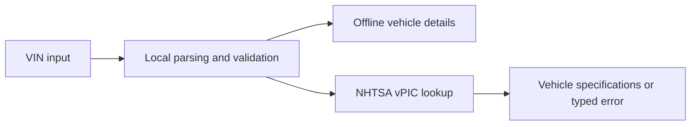

# VIN Decoder

Validate and decode Vehicle Identification Numbers. Every VIN is checked
locally first — including the ISO 3779 check digit — then enriched with full
vehicle specifications from the NHTSA vPIC API.

```bash
pip install -e .
vin-decode 1HGCM82633A004352
```

```
  2003 HONDA Accord

  VIN            1HGCM82633A004352
  Check digit    3 (valid)
  Manufacturer   Honda
  Region         North America
  Model year     2003
  Serial         004352

  Make                         HONDA
  Model                        Accord
  Model Year                   2003
  Trim                         EX-V6
  Body Class                   Coupe
  Engine Model                 J30A4
  Engine Number of Cylinders   6
  Displacement (L)             2.998832712
  Fuel Type - Primary          Gasoline
  Transmission Style           Automatic
  Plant City                   MARYSVILLE
```

## At a glance



## Why validate offline first

A VIN is self-describing. The ninth character is a check digit derived from the
other sixteen, so a mistyped VIN can be caught before any network request —
and the manufacturer, region and model year are encoded in fixed positions.

That matters in practice because the NHTSA API answers **`200 OK` even for a VIN
it cannot decode**, reporting the real outcome in an `Error Code` field inside
the response body. Checking the HTTP status alone silently yields empty results.
This client checks both.

Validating locally also means the tool degrades gracefully: if the API is
unreachable, you still get the check digit, manufacturer, region and model year.

```bash
vin-decode 5YJ3E1EA7HF000316 --offline
```

```
  VIN            5YJ3E1EA7HF000316
  Check digit    7 (MISMATCH)
                 expected X
  Manufacturer   Tesla
  Region         North America
  Model year     2017
```

## Usage

```bash
vin-decode <VIN>              # validate locally, then look up full specs
vin-decode <VIN> --offline    # no network; structural decode only
vin-decode <VIN> --json       # machine-readable output
vin-decode <VIN> --timeout 5  # cap the API wait
vin-decode                    # prompt for a VIN
```

Exit codes: `0` success, `1` invalid VIN, `2` lookup failed (offline results are
still printed).

Use it as a library:

```python
from vindecoder.vin import Vin
from vindecoder.nhtsa import decode_vin

vin = Vin("1HGCM82633A004352")
vin.is_valid        # True
vin.model_year      # 2003
vin.manufacturer    # 'Honda'

vehicle = decode_vin(str(vin))
vehicle.description # '2003 HONDA Accord'
```

## What a VIN encodes

| Position | Meaning |
|---|---|
| 1–3 | World Manufacturer Identifier — position 1 gives the region |
| 4–8 | Vehicle descriptor: model, body, engine (manufacturer-specific) |
| 9 | **Check digit**, computed from the other 16 characters |
| 10 | Model year |
| 11 | Assembly plant |
| 12–17 | Production serial number |

`I`, `O` and `Q` never appear in a VIN — they would be ambiguous with `1` and
`0` — so any VIN containing them is rejected outright.

The check digit transliterates each character to a number, multiplies by a
positional weight, and takes the sum modulo 11 (where `10` is written `X`). The
implementation was cross-checked against NHTSA's own verdict on a sample of
VINs and agreed on all of them.

## Layout

```
src/vindecoder/
    vin.py      offline parsing, validation, check digit  (no network)
    nhtsa.py    vPIC API client with typed errors
    cli.py      argparse entry point
tests/          44 tests, fully offline
```

`vin.py` has no network dependency, so the validation logic is testable in
isolation — the whole suite runs in well under a second and CI never depends on
a third-party service being up.

## Development

```bash
pip install -e ".[dev]"
pytest
```

CI runs the suite on Python 3.10–3.12 across Linux and Windows.

## Scope

Check-digit validation and structural decoding follow ISO 3779 and work for any
17-character VIN worldwide. The specification lookup uses NHTSA vPIC, which is
free and needs no API key; its coverage is richest for US-market vehicles,
though it accepts any VIN.

Registration-plate lookup (UK DVLA and equivalents) is deliberately out of
scope — those APIs need registered credentials, so they cannot be demonstrated
in an open repository.

## License

MIT — see [LICENSE](LICENSE).
